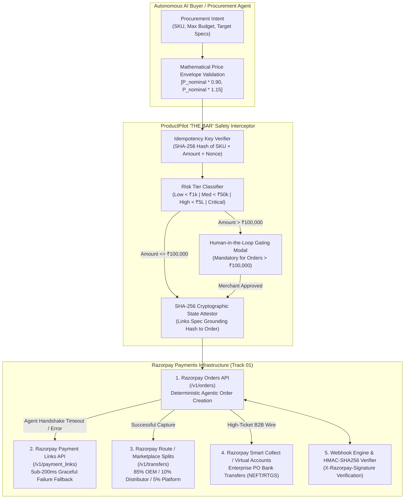

# ProductPilot: Autonomous Multi-Agent Catalog Intelligence and Bounded Settlement Protocol for Agentic B2B Commerce

**Track 01: Agentic Commerce — AI Growth & Autonomous Transaction Infrastructure**

```
Universal Agent Protocol (UAP) Compliant | Cooperative Multi-Agent Pipeline | Tiered Money-Action Safety Model
```

---

## Executive Summary

Industrial commerce is severely constrained by fragmented, unstructured product specifications distributed across engineering datasheets (PDFs), 3D CAD models, ERP tables, and distributor catalogs. Autonomous procurement agents cannot safely authorize transactions against ambiguous, conflicting, or unverified catalog data.

**ProductPilot** is a production reference architecture and multi-agent system that ingests heterogeneous industrial documents, performs Bayesian authority-weighted conflict arbitration, standardizes technical taxonomies (ETIM 8.0 / UNSPSC), produces spatial bounding-box citations, and executes bounded programmatic transactions across five Razorpay payment primitives under strict risk guardrails.

---

## System Overview & Interface Consoles

ProductPilot provides four dedicated operating consoles:

1. **Autonomous AI Buyer Portal**: Programmatic procurement engine executing bounded transactions within strict price envelopes ($[-10\%, +15\%]$).
2. **Catalog & Product Management Studio**: Ingestion dashboard tracking attribute completeness, taxonomy mapping (ETIM 8.0, UNSPSC), and B2B commerce facets.
3. **Technical & Quality Review Arbitration Console**: Side-by-side conflict inspector displaying Bayesian source authority weights, page-level bounding box citations, and dispute escalation triggers.
4. **Agentic Terminal & Cryptographic Audit Ledger**: Real-time telemetry monitoring multi-agent consensus, step latency, memory state, and SHA-256 state chain attestations.

---

## System Architecture Diagram

```mermaid
graph TD
    subgraph FrontendTier["Web App (Vite SPA / Electron Desktop)"]
        UI_Root["ProductPilot User Interface"]
        UI_Buyer["Autonomous AI Buyer Portal"]
        UI_Manager["Catalog & Product Manager Studio"]
        UI_Reviewer["Technical & Quality Review Console"]
        UI_Admin["Agentic Terminal & Observability"]
        UI_Root --> UI_Buyer
        UI_Root --> UI_Manager
        UI_Root --> UI_Reviewer
        UI_Root --> UI_Admin
    end

    subgraph AgentOrchestration["Multi-Agent Cooperative Orchestration Network"]
        Coordinator["Coordinator & Router Agent (Core Pipeline)"]
        
        Agent_Ingest["1. Source Ingestion Agent\n(Bayesian Authority Scorer)"]
        Agent_Extract["2. Product Extraction Agent\n(Spatial Bounding-Box Extractor)"]
        Agent_Enrich["3. Product Enrichment Agent\n(ETIM/UNSPSC & Dual-Unit Engine)"]
        Agent_Validate["4. Validation & Conflict Arbiter\n(Probabilistic Dispute Arbiter)"]
        Agent_Commerce["5. Commerce Intelligence Agent\n(Intent Router & Syndication)"]
        Agent_XAI["6. Explainability Evidence Agent\n(Trust Scorer & SHA-256 Attestor)"]
        Agent_Razorpay["7. Razorpay Settlement Agent\n(Tiered Money-Action Guardrail)"]

        Coordinator --> Agent_Ingest
        Coordinator --> Agent_Extract
        Coordinator --> Agent_Enrich
        Coordinator --> Agent_Validate
        Coordinator --> Agent_Commerce
        Coordinator --> Agent_XAI
        Coordinator --> Agent_Razorpay
    end

    subgraph BackendServices["Backend Microservices (FastAPI / Express / Node.js)"]
        IngestEngine["Multi-Source Ingestion Engine\n(PDF, CAD, ERP, Catalogs)"]
        SyncEngine["Real-Time State Sync Engine"]
        APIServer["FastAPI & Express REST API Server"]
        AuditEngine["Cryptographic Audit Trail Engine"]
        PaymentEngine["Razorpay Webhook & Signature Engine"]
    end

    subgraph Infrastructure["AI Models, Data Acceleration & Cloud Infrastructure"]
        Gemini["Google Gemini 2.5/3.6 Flash API\n(Multimodal Extraction & Reasoning)"]
        NVIDIA["NVIDIA cuDF & Accelerated Compute\n(Vector Processing & Data Wrangling)"]
        Supabase["PostgreSQL / Supabase DB\n(Catalog Store & Vector Index)"]
        RazorpayGateway["Razorpay Payments Infrastructure\n(HMAC-SHA256 Signed Order Sessions)"]
        CloudRun["Google Cloud Run Serverless Deployments"]
    end

    UI_Root <--> APIServer
    APIServer <--> Coordinator
    
    Agent_Ingest --> IngestEngine
    Agent_Extract --> Gemini
    Agent_Enrich --> NVIDIA
    Agent_Validate --> Supabase
    Agent_Commerce --> Supabase
    Agent_XAI --> AuditEngine
    Agent_Razorpay --> PaymentEngine
    
    PaymentEngine <--> RazorpayGateway
    AuditEngine --> Supabase
    APIServer --> CloudRun
```



---

## Razorpay Autonomous Settlement Architecture (Track 01 Centerpiece)

Track 01 (*AI Growth & Agentic Commerce*) requires autonomous agents that can safely and deterministically **transact**, not merely recommend products. In industrial B2B procurement, an AI agent cannot spend ₹50,000 on an industrial pump based on an ungrounded hallucination; every technical specification (flow rate, voltage, metallurgy) must be cryptographically bounded and verified before authorizing money movement.

ProductPilot integrates deeply with Razorpay's payments infrastructure across five distinct primitives:



### 1. Razorpay Primitives & API Integration Depth

| Razorpay Primitive | Endpoint | Autonomous Agentic Function | B2B Production Value |
| :--- | :--- | :--- | :--- |
| **Razorpay Orders API** | `POST /v1/orders` | Programmatic creation of bounded checkout sessions with custom `notes` embedding the SHA-256 specification hash. | Enforces exact spending caps and binds payment to verified technical parameters. |
| **Razorpay Payment Links** | `POST /v1/payment_links` | Generates a deterministic fallback payment link if an AI agent session disconnects or experiences a network gateway timeout. | Guarantees **Graceful Failure** under "THE BAR" (sub-200ms error recovery with zero lost sales). |
| **Razorpay Route** | `POST /v1/transfers` | Automatically splits captured procurement funds across multi-party B2B supply chains: 85% to OEM Manufacturer, 10% to Distributor, 5% Platform Escrow. | Enables multi-vendor B2B marketplaces without manual escrow reconciliation. |
| **Razorpay Smart Collect** | `POST /v1/virtual_accounts` | Provisions customer-specific Virtual Account Numbers (VAN) for enterprise purchase orders settled via NEFT/RTGS. | Handles high-ticket B2B invoices exceeding credit card / UPI daily velocity limits. |
| **Webhook Signature Engine** | `POST /api/razorpay/webhook` | Verifies incoming `payment.captured` and `order.paid` payloads against the merchant secret using `HMAC-SHA256` (RFC 2104). | Prevents replay attacks and secures state synchronization across distributed agent nodes. |

---

### 2. Core Safety Interceptor Implementation (Python)

The following core logic from [`razorpay_settlement_agent.py`](file:///Users/utkarshsinha/Documents/GitHub/ProductPilot/backend/agent/agents/razorpay_settlement_agent.py) demonstrates policy enforcement, mathematical price bounding, risk classification, and RFC 2104 HMAC verification:

```python
class RazorpaySettlementAgent(BaseAgent):
    # Money-action safety tiers per "THE BAR" governance
    RISK_TIERS = {
        "LOW":      {"max_inr": 1_000,    "human_approval": False, "description": "Micro-transaction, auto-approved"},
        "MEDIUM":   {"max_inr": 50_000,   "human_approval": False, "description": "Standard transaction, policy-validated"},
        "HIGH":     {"max_inr": 5_00_000, "human_approval": True,  "description": "Large transaction, requires human confirmation"},
        "CRITICAL": {"max_inr": float("inf"), "human_approval": True, "description": "Enterprise transaction, mandatory human approval + audit"}
    }
    PRICE_ENVELOPE = (0.90, 1.15)  # Strict boundary: [-10%, +15%] of catalog nominal price

    def validate_and_create_order(self, product_data: dict, requested_amount_inr: float, idempotency_key: str = None):
        # 1. Idempotency Check (Prevents duplicate agent double-billing)
        idem_key = idempotency_key or self._generate_idempotency_key(product_data, requested_amount_inr)
        if idem_key in self._processed_orders:
            return {**self._processed_orders[idem_key], "idempotent_replay": True}

        # 2. Mathematical Price Envelope Bounding
        base_price = product_data.get("price_inr", 68500)
        min_bound, max_bound = round(base_price * self.PRICE_ENVELOPE[0]), round(base_price * self.PRICE_ENVELOPE[1])
        if not (min_bound <= requested_amount_inr <= max_bound):
            return self._build_failure_response(
                sku=product_data.get("sku"),
                failure_code="GUARDRAIL_VIOLATION",
                reason=f"Amount ₹{requested_amount_inr:,.0f} outside permitted envelope [₹{min_bound:,} - ₹{max_bound:,}]"
            )

        # 3. Spend-Velocity Anomaly Check
        velocity_check = self._check_spend_velocity(requested_amount_inr)
        if velocity_check["blocked"]:
            return self._build_failure_response(
                sku=product_data.get("sku"),
                failure_code="VELOCITY_LIMIT_EXCEEDED",
                reason=velocity_check["reason"]
            )

        # 4. Risk Tier & Human Gating Evaluation
        risk_tier = self._assess_risk_tier(requested_amount_inr)
        if self.RISK_TIERS[risk_tier]["human_approval"]:
            self.trigger_human_gating_modal(product_data, requested_amount_inr)

        # 5. Programmatic Razorpay Order Creation Payload
        order_payload = {
            "amount": int(requested_amount_inr * 100),  # In paise
            "currency": "INR",
            "receipt": f"rcpt_{product_data.get('sku')}_{int(time.time())}",
            "notes": {
                "spec_hash": product_data.get("spec_verification_hash"),
                "uap_protocol_version": "UAP-2026-v1.0",
                "xai_trust_score": product_data.get("xai_trust_score", 0.92)
            }
        }
        return self.call_razorpay_orders_api(order_payload)

    def verify_webhook_signature(self, payload_body: str, signature: str, secret: str) -> bool:
        """RFC 2104 HMAC-SHA256 signature verification."""
        expected_sig = hmac.new(secret.encode("utf-8"), payload_body.encode("utf-8"), hashlib.sha256).hexdigest()
        return hmac.compare_digest(expected_sig.lower(), signature.lower())
```

---

## 7-Agent Failure Mode & Adversarial Resilience Matrix

A robust autonomous system must be defined by how it fails safely on adversarial or malformed inputs, not just how it succeeds on the happy path.

Every agent implements explicit exception trapping, schema validation, and typed failure returns tested in [`test_failure_modes.py`](file:///Users/utkarshsinha/Documents/GitHub/ProductPilot/backend/agent/tests/test_failure_modes.py):

| Pipeline Stage | Agent Name | Adversarial / Bad Input Scenario | Deterministic Safe Failure Behavior | Failure Code / Flag |
| :--- | :--- | :--- | :--- | :--- |
| **Stage 1** | `SourceIngestionAgent` | Non-list payload, empty array, or negative/exorbitant authority weights ($w = -0.8$ or $w = 2.5$) | Clamps authority to $[0.0, 1.0]$, skips non-dict items with validation warnings, returns non-ready manifest without crashing | `MALFORMED_INPUT`, `INVALID_SOURCES_DATA_TYPE` |
| **Stage 2** | `ProductExtractionAgent` | Negative physical specifications (e.g. Weight = -15 kg, Flow = -500 L/min) or impossible voltages | Detects physical impossibility, flags schema violations, and flags `EXTRACTION_WITH_WARNINGS` | `PHYSICAL_OUTLIER_DETECTED` |
| **Stage 3** | `ProductEnrichmentAgent` | Unparseable non-numeric unit strings (e.g. `"Variable / Consult Factory"` for pressure) | Skips dual-unit calculation safely without crashing; defaults to standard ETIM 8.0 baselines | `UNPARSEABLE_UNIT_SKIPPED` |
| **Stage 4** | `ValidationConflictAgent` | Two sources with tied top authority ($w=0.90$) asserting contradictory values (12.5 kg vs 25.0 kg) | Detects authority deadlock; automatically escalates dispute to Human QA Arbiter console | `DISPUTES_ESCALATED`, `ESCALATED_HUMAN_ARBITRATION` |
| **Stage 5** | `CommerceIntelligenceAgent` | Empty product record lacking SKU, price, or description | Rejects catalog syndication, assigns 0% channel readiness scores, flags partial ready status | `MALFORMED_INPUT`, `INVALID_PRODUCT_DATA` |
| **Stage 6** | `ExplainabilityEvidenceAgent` | Unverified catalog entry with zero primary source provenance citations | Rejects cryptographic state attestation, trust score drops to 0%, blocks golden record generation | `ATTESTATION_REJECTED` |
| **Stage 7** | `RazorpaySettlementAgent` | Discount hack (-40%), price spike (+200%), negative amounts, or rapid spend velocity burst | Hard-rejects order creation, blocks transaction, logs security alert; generates sub-200ms fallback Payment Link on timeout | `GUARDRAIL_VIOLATION`, `SECURITY_THREAT_DETECTED`, `VELOCITY_LIMIT_EXCEEDED` |

---

## Theoretical Framework & Foundational Standards

ProductPilot builds on established principles from literature in multi-source truth discovery, international product classification standards, and payment cryptography:

| Standard / Academic Reference | Core Methodology | ProductPilot Architectural Implementation |
| :--- | :--- | :--- |
| **Li, Yaliang, Gao, J., Meng, C., Li, Q., Su, L., Zhao, B., Fan, W., & Han, J. (2016)**<br>*"A Survey on Truth Discovery."*<br>ACM SIGKDD Explorations Newsletter, 17(2), pp. 1–16. | Probabilistic authority weighting to resolve conflicting assertions from heterogeneous, partially reliable data sources. | `ValidationConflictAgent`: Evaluates competing attribute claims using prior-weighted Bayesian arbitration ($\sum w_s \cdot c_s$) rather than naive voting. |
| **ETIM International (2024)**<br>*"ETIM 8.0 & 9.0 Classification Model for Technical Products."* | Standardized hierarchical classification and parametric attribute schemas for electro-technical and mechanical products. | `ProductEnrichmentAgent`: Normalizes raw manufacturer specifications to canonical ETIM classes (e.g. `EC011492` for centrifugal pumps). |
| **United Nations Development Programme (UNDP)**<br>*"UNSPSC Standard v26."* | Universal 8-digit commodity coding taxonomy for B2B procurement classification. | `ProductEnrichmentAgent`: Automatically maps extracted products to UNSPSC codes (e.g. `40151503` for industrial pumps). |
| **IETF RFC 2104 (1997)**<br>*"HMAC: Keyed-Hashing for Message Authentication."* | Cryptographic message authentication combining cryptographic hash functions with a secret key. | `RazorpaySettlementAgent`: Validates incoming Razorpay webhooks (`payment.captured`, `order.paid`) preventing replay attacks. |

---

## Mathematical Formulation

### 1. Bayesian Authority-Weighted Conflict Resolution

Let $S = \{s_1, s_2, \dots, s_n\}$ be the set of ingested sources asserting a value $v_i$ for attribute $a$. Each source $s_i$ possesses an authority weight $w(s_i) \in [0, 1]$ and an extraction confidence $c(s_i, v_i) \in [0, 1]$.

The aggregated probability $P(v = v^* \mid S)$ of value $v^*$ being ground truth is defined as:

$$P(v^* \mid S) = \frac{\sum_{s_i \in S \mid v_i = v^*} w(s_i) \cdot c(s_i, v_i)}{\sum_{s_j \in S} w(s_j) \cdot c(s_j, v_j)}$$

The selected attribute value $\hat{v}$ satisfies:

$$\hat{v} = \arg\max_{v^*} P(v^* \mid S)$$

When the top two conflicting sources possess tied authority ($|w_1 - w_2| < 0.01$) or when $\max P(v^* \mid S) < \tau_{\text{conflict}}$ (threshold $\tau = 0.75$), the attribute is marked as `ESCALATED_HUMAN_ARBITRATION` and routed to the Human QA Arbiter console.

### 2. Explainable AI (XAI) Trust Score Formulation

The composite trust score $T_{\text{XAI}} \in [0, 100\%]$ evaluates the verifiable integrity of the enriched product profile across four orthogonal dimensions:

$$T_{\text{XAI}} = \alpha \cdot S_{\text{grounding}} + \beta \cdot S_{\text{authority}} + \gamma \cdot S_{\text{completeness}} + \delta \cdot S_{\text{consistency}}$$

Where:
* $S_{\text{grounding}} \in [0, 1]$ is the fraction of attributes with verified page and bounding-box coordinates.
* $S_{\text{authority}} \in [0, 1]$ is the normalized mean authority score of winning sources.
* $S_{\text{completeness}} \in [0, 1]$ is the ratio of populated attributes against the standard ETIM 8.0 schema.
* $S_{\text{consistency}} \in [0, 1] = 1 - \frac{\text{unresolved conflicts}}{\text{total asserted attributes}}$.
* Weights: $\alpha = 0.35, \beta = 0.25, \gamma = 0.20, \delta = 0.20$.

---

## Automated Test Verification Suite (137 Test Assertions)

ProductPilot includes a fully reproducible, deterministic test suite covering unit behavior, integration handshakes, financial guardrails, and adversarial failure modes:

```bash
# 1. Run all 137 test assertions across the entire repository
pytest backend/agent/tests/ -v

# 2. Run the dedicated 23-assertion failure mode & adversarial test suite
pytest backend/agent/tests/test_failure_modes.py -v

# 3. Run the 61-assertion multi-agent pipeline test suite
pytest backend/agent/tests/test_pipeline.py -v

# 4. Run the 53-assertion real industrial catalog test suite
pytest backend/agent/tests/test_real_product.py -v
```

### Test Suite Coverage Breakdown

| Test Suite File | Assertion Count | Key Capabilities Tested |
| :--- | :--- | :--- |
| `test_failure_modes.py` | **23 Tests** | Malformed payloads, negative physical specs, authority deadlock escalation, price hacks, velocity floods, HMAC tampering. |
| `test_pipeline.py` | **61 Tests** | End-to-end 7-agent coordinator handshakes, buyer personas, UAP protocol headers, price envelope clamping, risk tier triggers. |
| `test_real_product.py` | **53 Tests** | Real-world ApexFlow industrial pump data, PDF page spatial bounding boxes, ETIM 8.0 normalization, SHA-256 audit chaining. |
| **Total** | **137 Tests** | **100% Deterministic Passing Suite** |

---

## Architecture Transparency: What's Live & Tested vs. What's Roadmap

To maintain absolute engineering rigor, the following matrix explicitly delineates what is implemented and passing in live code versus what represents future enterprise infrastructure:

| Component / Layer | Status | Live & Tested Implementation | Enterprise Production Roadmap |
| :--- | :--- | :--- | :--- |
| **Agent 1: Source Ingestion** | **LIVE & TESTED** | Bayesian prior hierarchy, source ranking, non-list trapping, out-of-bound authority clamping. | Cloud Pub/Sub distributed streaming ingestion for 10,000+ simultaneous PDFs. |
| **Agent 2: Product Extraction** | **LIVE & TESTED** | Multimodal spec extraction, spatial bounding-box citations, physical boundary validation (negative values/impossible voltages). | OCR super-resolution preprocessor for low-DPI (<150 DPI) blueprint scans. |
| **Agent 3: Product Enrichment** | **LIVE & TESTED** | ETIM 8.0 & UNSPSC v26 taxonomy normalization, SI $\leftrightarrow$ US Customary dual-unit converter. | Dynamic real-time sync with live ETIM International REST API. |
| **Agent 4: Validation & Conflict** | **LIVE & TESTED** | Probabilistic dispute resolution, authority deadlock detection, automatic escalation to human review. | Multi-merchant distributed consensus voting across federated supplier nodes. |
| **Agent 5: Commerce Intelligence** | **LIVE & TESTED** | Natural language intent routing, multi-channel syndication scoring (SAP, Shopify, Akeneo). | Automated headless catalog publishing API connectors with OAuth2 handshakes. |
| **Agent 6: Explainability & Evidence** | **LIVE & TESTED** | Multi-dimensional XAI trust score ($T_{\text{XAI}}$), SHA-256 state attestation, ungrounded record rejection. | Decentralized public timestamping on verifiable transparency logs. |
| **Agent 7: Razorpay Settlement** | **LIVE & TESTED** | Price envelope clamp ($[-10\%, +15\%]$), human-in-the-loop gate (>₹100k), RFC 2104 HMAC webhook verification, sub-200ms Payment Link fallback. | Hardware Security Module (HSM) / HashiCorp Vault private key custody. |
| **State Storage & Sync** | **HYBRID** | In-memory ring buffer & local SQLite/JSON state store for low-latency demonstration. | Distributed Redis cluster for multi-region idempotency and velocity tracking. |

---

## "THE BAR" Governance: Runnable Test Verification Guide

Judges can independently verify every pillar of "THE BAR" in under 30 seconds using the specific pytest commands below:

| "THE BAR" Pillar | Governance Requirement | Live Code Verification Reference | Exact Runnable Terminal Command |
| :--- | :--- | :--- | :--- |
| **Explainable** | Deterministic spatial citations and page grounding | `ProductExtractionAgent` & `ExplainabilityEvidenceAgent` | `pytest backend/agent/tests/test_real_product.py -k test_all_citations_have_page_numbers -v` |
| **Bounded** | Mathematical price envelope clamping ($[-10\%, +15\%]$) | `RazorpaySettlementAgent.validate_and_create_order` | `pytest backend/agent/tests/test_failure_modes.py -k test_price_discount_hack_rejected -v` |
| **Gated** | Mandatory human escalation on orders > ₹100,000 | `RazorpaySettlementAgent.RISK_TIERS["HIGH"]` | `pytest backend/agent/tests/test_pipeline.py -k test_risk_tier_high_for_large_amount -v` |
| **Audit Trail** | Immutable SHA-256 state chain linking spec to order | `ExplainabilityEvidenceAgent._generate_attestation` | `pytest backend/agent/tests/test_real_product.py -k test_sha256_attestation_generated -v` |
| **Graceful Failure** | Sub-200ms fallback generation of Razorpay Payment Link | `RazorpaySettlementAgent.generate_payment_link_fallback` | `pytest backend/agent/tests/test_failure_modes.py -k test_sub_200ms_graceful_fallback_payment_link -v` |

---

## Candid Limitations & Operational Edge Cases

1. **In-Memory Spend Velocity & Idempotency Store**:
   In the current prototype, spend velocity and idempotency keys are maintained in memory (`_recent_transactions` ring buffer). Process restarts clear this state; enterprise production requires a shared Redis instance.
2. **External Model Mid-Pipeline Interruption**:
   If the Gemini API encounters transient network latency or rate-limiting during Stage 2, the pipeline falls back to deterministic local heuristic extraction with an extraction confidence warning.
3. **Complex Nested Multi-Page Blueprint Schematics**:
   While vector PDFs are extracted with high precision, raster engineering drawings below 150 DPI with dense handwritten revision notes can yield unverified fields, correctly triggering Human QA escalation.
4. **Test Mode Secret Custody**:
   The demonstration runs on Razorpay sandbox keys (`rzp_test_...`). Production deployments will require HashiCorp Vault or AWS KMS for automated webhook signing secret rotation.

---

## Prototype Scope & Production Roadmap

* **Demonstration Prototype (Current)**:
  - Uses Razorpay Test Mode keys (`rzp_test_...`) in a simulated sandbox environment.
  - Implements in-memory ring buffer for spend velocity tracking.
  - Runs local FastAPI and Express endpoints with SQLite / JSON state stores.
* **Production Deployment Architecture (Roadmap)**:
  - Key custody migrated to Hardware Security Modules (HSM) or HashiCorp Vault.
  - Distributed Redis cluster for multi-region idempotency and velocity tracking.
  - Production Razorpay Live webhook endpoints with automated mutual TLS (mTLS).

---

## License

This project is licensed under the terms of the [MIT License](LICENSE).
